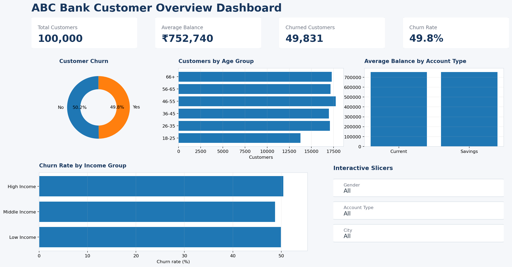

# Bank Customer Power BI Dashboard

A simple one-page Power BI dashboard analyzing bank customer churn, balances, demographics and customer segments.

## Dashboard Preview

## Key KPIs

•⁠  ⁠Total Customers: 100,000
•⁠  ⁠Average Balance: ₹752,740
•⁠  ⁠Churned Customers: 49,831
•⁠  ⁠Churn Rate: 49.8%

## Dashboard Features

•⁠  ⁠Customer Churn Analysis
•⁠  ⁠Customer Distribution by Age Group
•⁠  ⁠Average Balance by Account Type
•⁠  ⁠Churn Rate by Income Group
•⁠  ⁠Gender, Account Type and City slicers

## Tools Used

•⁠  ⁠Power BI
•⁠  ⁠Power Query
•⁠  ⁠DAX
•⁠  ⁠Data Visualization
•⁠  ⁠Data Analysis

## Project Files

The complete Power BI project is available inside:

⁠ Bank_Customer_Power_BI_Dashboard-1 ⁠

The folder contains the Power BI project, semantic model, report definition, DAX measures, source dataset and dashboard preview.
